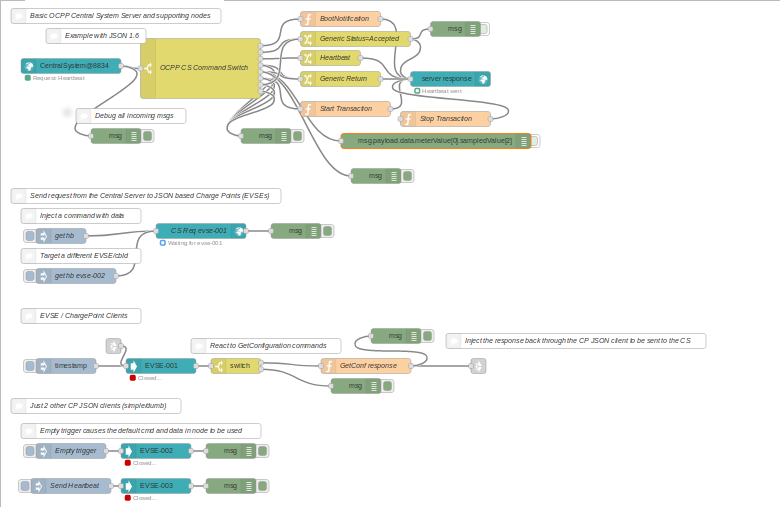

# node-red-contrib-ocpp

[](https://nodei.co/npm/node-red-contrib-ocpp/)

[Node-Red][4] nodes for communicating with the EVSE Charge Points and Central Systems via the [Open Charge Point Protocol][6] (hereafter OCPP). These node-red nodes
allow you to take on the role of a Central System (CS) or Charge Point (CP).  

Based on the [OCPP 1.5][6] and [OCPP 1.6][8] specifications utilizing the Simple Object Access Protocol (hereafter SOAP) and JavaScript Object Notation (hereafter JSON) protocols.

# Install

Run the following command in the root directory of your Node-RED install

    npm install node-red-contrib-ocpp


# Requirements

The package currently requires [Node.js 8.5][1] or higher.

# Nodes

* [CS request SOAP](#csrequestsoap)
* [CP request SOAP](#cp-request-soap)
* [CS server](#cs-server)
* [CP server SOAP](#cp-server-soap)
* [CP client JSON](#cp-client-json)
* [server response](#server-response)
* [CS request JSON](#cs-request-json)
* [examples](#examples)


_(nodes that begin with CS refer to those that emulate a Central System. Those with CP refer to those that emulate a Charge Point/EVSE)_

---
## CS request SOAP
This node allows you to make requests to an EVSE charge point and return a message with the response from that request. The targeted EVSE charge point must support either 1.5 or 1.6 SOAP (this node does not support JSON) It is flexible in that you can either set up a default command and/or data to send when you configure the node, or you may pass in 
that information to override the defaults via a message payload.

For example, to set up a *Reset* command request, you can select the *Reset* command from the nodes configuraiton dropdown. The Reset command
also requires sending a parameter indicating the type of reset to be performed, either *hard* or *soft*. In the Command Params field of the configuration, you would provide a JSON formatted object similar to this:

```javascript
{
    "type": "Soft"
}
```


Alternately, you can pass the node a payload which contains a command and/or data to override the defaults. To make a *Reset* request
by passing it a message, the message payload (*msg.payload*) would look as follows:


```javascript
{
    "commnad": "Reset",
    "data" : { "type" : "Hard" }
}
```

If either the command or the data sections are missing from from the message, the defaults set up in the nodes configuration will be used. If you set up an *[CS request SOAP](#cs-request-soap)* node
with a default command of *Reset*, you could pass in just the following:


**for hard reset**
```javascript
{
    "data": { "type": "Hard" }
}
```

**for soft reset**
```javascript
{
    "data": { "type": "Soft"}
}
```
**User Generated Message IDs**

For all request nodes the option exists to also pass in a user generated message ID that will be used to identify the message. 

```javascript
{
    "commnad": "Reset",
    "data" : { "type" : "Hard" },
    "MessageId": "12345678"
}
```
This may make it easier for you to identify and track your message throughout your flows. By default, the node modules internally generate a unique id for request messages based on [UUID v4](http://www.ietf.org/rfc/rfc4122.txt)


**Output**

The output returned by the node has the following message format:

```javascript
{
    "ocpp": {
        "command": "<the command being responded to>",
        "chargeBoxIdentity": "<the name of the EVSE charge box responding>",
        "url": "<the URL of the responding charge box>",
        "data": "<the data that was sent with the command to make the request>"        
    },
    "payload": {
        "command": "<the command being responded to>",
        "key": "value"
    }
}
```
Example return message from a OCPP 1.5 SOAP

```javascript
{
    "_msgid":"58c0fa49.ecac14",
    "topic":"",
    "ocpp":{
        "command":"Reset",
        "MessageId":"f58ec0fb-b6fd-48a3-9a0c-2e0cba143388",
        "chargeBoxIdentity":"Chargion6D94",
        "url":"http://204.188.169.51:8080/chargePoint",
        "ocppVer":"1.5s",
        "data":{
            "type":"Soft"
        }
    },
    "payload":{
        "command":"Reset",
        "data":{
            "status":"Accepted"
        }
    }
}
```

The payload portion varies depending on the command and EVSE charge point vendor specifications.

---
## CP request SOAP
This node is used to emulate a EVSE charge point station and is capable of making requests to a Central System service that support either protocol 1.5 or 1.6 SOAP. Its behavior is similar to that of the *[CS request SOAP](#cs-request-soap)* node.

To emulate a EVSE charge point station that utilizes OCPP 1.6 JSON, use the *[CP client JSON](#cp-client-json)* node.

---
## CS server
The ocpp-server node will listen for incoming requests coming from the EVSE charge points that are targeting its address. It is capable of receiving messages via 1.5 SOAP, 1.6 SOAP, and 1.6 JSON if the protocols are enabled in its configuration.
When the ocpp-server node receives a message, it will output a message in the following format:

```javascript
{
    "ocpp": {
        "ocppVersion": "<protocol version of message: 1.5, 1.6, or 1.6j>",
        "command": "<the command being requested>",
        "chargeBoxIdentity": "<the name of the charge box making the request>",
        "From": "<optional address of the incoming request>",
        "MessageID": "<optional incoming request message id generated by the charge box>",
        "messageType": "<only sent if the message is a JSON message. 2=request, 3=reply>"
    },
    "payload": {
        "command": "<the command being requested>",
        "data": "<arguments received with the incoming request command stored in key/value pairs>"
    }
}
```
Here is an example of a OCPP 1.6 JSON Heartbeat request message.
```javascript
{   "ocpp":{
        "ocppVersion": "1.6j",
        "chargeBoxIdentity": "veefil-48310","MessageId": "uuid:f1d11de1-5725-9255-854b-da6542b4d9bb",
        "msgType": 2,
        "command": "Heartbeat"
    },
    "payload":{
        "command": "Heartbeat",
        "data":{}
    },
    "msgId":"e38e0e7f-3db2-4a33-ab80-859175ebfce0","_msgid":"d310afd9.b9de8"
}
```
The incoming messages require a response (sent through the *[server response](#server-response)* node), and those responses should be sent within 
a reasonable amount of time. The ocpp-server node will cancel any outstanding responses after a 2 minute time period. The EVSE side 
may timeout awaiting a response even sooner than that depending on their configuration.

---
## server response
To return a response to an incoming EVSE charge point request, you need to pass your message to the *[server response](#server-response)* node. Since the message 
coming out of the ocpp-server node contains information about how to return the response, the message itself should be passed as is through
the node flow with the exception of the msg.payload section. The msg.payload should be modified to contain the response to the incoming request.

For example, to accept a *BootNotification* request, set the payload of the response as:

```javascript
{
    "status": "Accepted",
    "currentTime": new Date().toISOString(),
    "heartbeatInterval": 60
}
```

(The message being passed from the server contains a unique identifier contained in msg.msgID. This needs to be present in the response message in order for the message to be returned to the proper request)

---
## CP server SOAP
This node emulates an EVSE charge point station server that accepts and responds to OCPP 1.5 or 1.6 SOAP messages being sent from a a Central System service. Setup and behavior are similar to that of the *[CS server](#cs-server)*. Use this node in conjunction with a *[server response](#server-response)* node to pass responses to requests back to a Central System. 

_Unlike the *[CS Server](#cs-server)* this node does not incorporate or support multiple protocols running concurrently, nor does it support JSON. To emulate an EVSE charge point that supports JSON, use the *[CP client JSON](#cp-client-json)* node._

---
## CP client JSON
Use this node to emulate an EVSE charge point station that supports OCPP protocol 1.6 JSON. Since the OCPP JSON implementation utilizes web sockets, this node makes the initial connection to the defined Central System, and messages are passed back and forth. Therefore it acts like both a server and a client in that it both makes and receives requests to and from the CS.

## CS request JSON
Use this node to make requests to an EVSE charge point station that support OCPP 1.6 JSON. Its behavior and functionality are similar to that of the *[CS request SOAP](#cs_request-soap)* node with the exception that it only support OCPP 1.6 JSON commands.


## examples



In the root of the OCPP node module folder is a folder named examples. This is where you can find example flows that may be useful in setting up your OCCP situation. Currently a single example file exists which you can import into node-red that sets up a Central System node with a few basic Charge Point nodes. This is by no means a full production example, but just a starting point for those who may be interested in a way to setup the nodes.


# Authors

[Jason D. Harper][5]

[Bryan Nystrom][11]

[Argonne National Laboratory][10]

[1]:https://nodejs.org/
[2]:https://na.chargepoint.com/UI/downloads/en/ChargePoint_Web_Services_API_Guide_Ver4.1_Rev4.pdf
[3]:https://webservices.chargepoint.com/cp_api_4.1.wsdl
[4]:http://nodered.org
[5]:https://github.com/jayharper
[6]:http://www.openchargealliance.org/protocols/ocpp/ocpp-15/
[7]:http://www.openchargealliance.org/uploads/files/protected/ocpp_specification_1.5_final.pdf
[8]:http://www.openchargealliance.org/protocols/ocpp/ocpp-15/
[9]:http://www.openchargealliance.org/uploads/files/protected/ocpp_specification_1.5_final.pdf
[10]:https://www.anl.gov
[11]: https://github.com/bnystrom
